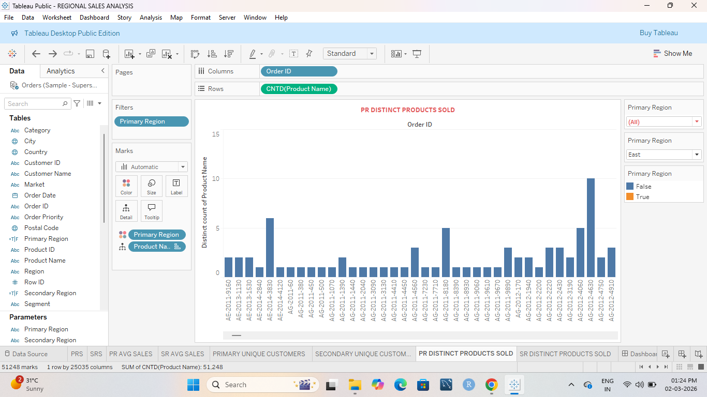
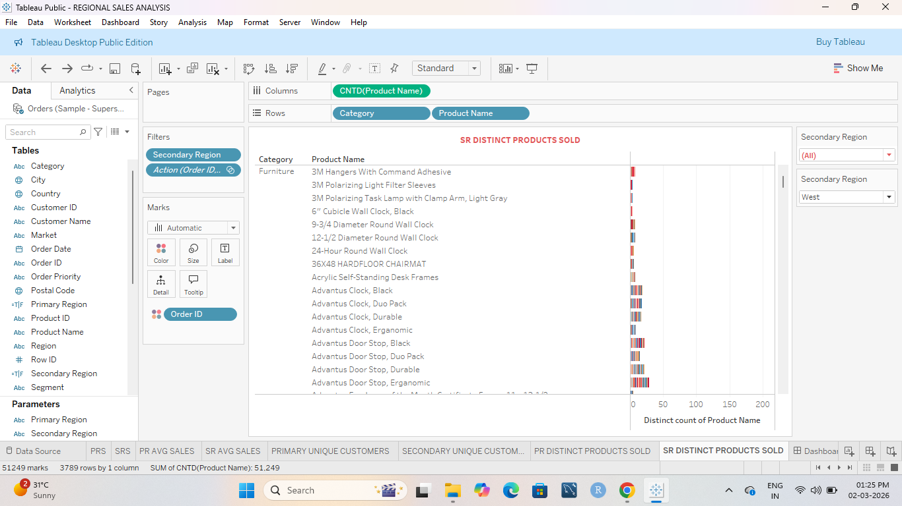
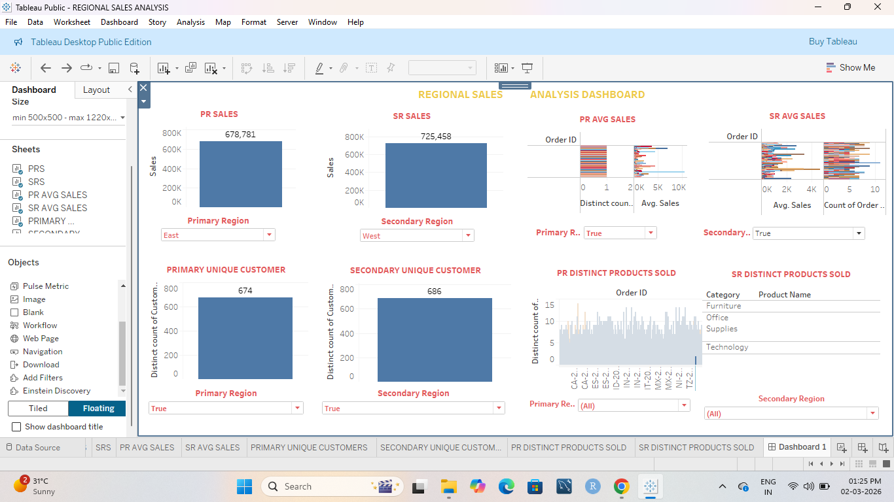

# 📊 Regional Sales Analysis Dashboard (Tableau)

## 📌 Project Overview
Developed an interactive Tableau dashboard to analyze and compare Primary and Secondary regional sales performance. The dashboard highlights key KPIs such as total sales, average sales, unique customers, and distinct products sold.

---

## 🛠 Tools & Technologies
- Tableau
- Calculated Fields
- Interactive Filters
- KPI Cards
- Dashboard Actions

---

## 📈 Dashboard Components

### 1️⃣ PR Sales

### 2️⃣ SR Sales

### 3️⃣ Primary Region – Average Sales

### 4️⃣ Secondary Region – Average Sales

### 5️⃣ Primary Unique Customers

### 6️⃣ Secondary Unique Customers

### 7️⃣ Primary Region – Distinct Products Sold

### 8️⃣ Secondary Region – Distinct Products Sold

### 9️⃣ Final Combined Dashboard

---

## 🎯 Key Insights
- Comparison of Primary vs Secondary region performance
- Sales trend and average order insights
- Customer distribution analysis
- Product category performance evaluation

---

## 🚀 Project Objective
To enable regional performance comparison and support data-driven business decisions using interactive Tableau visualizations.
