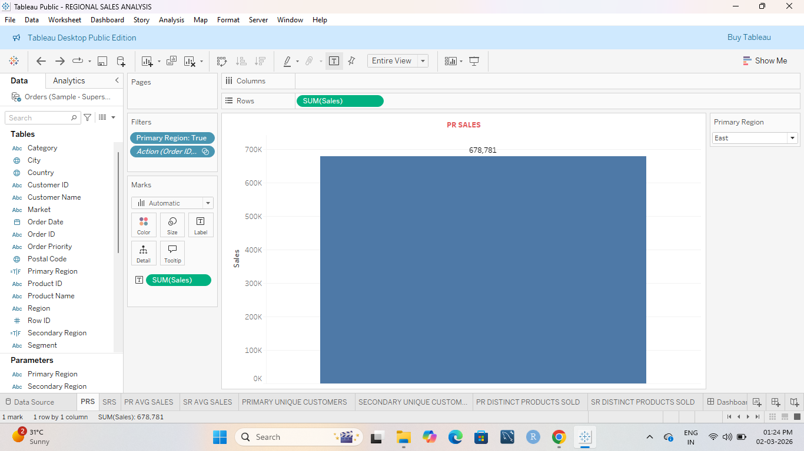
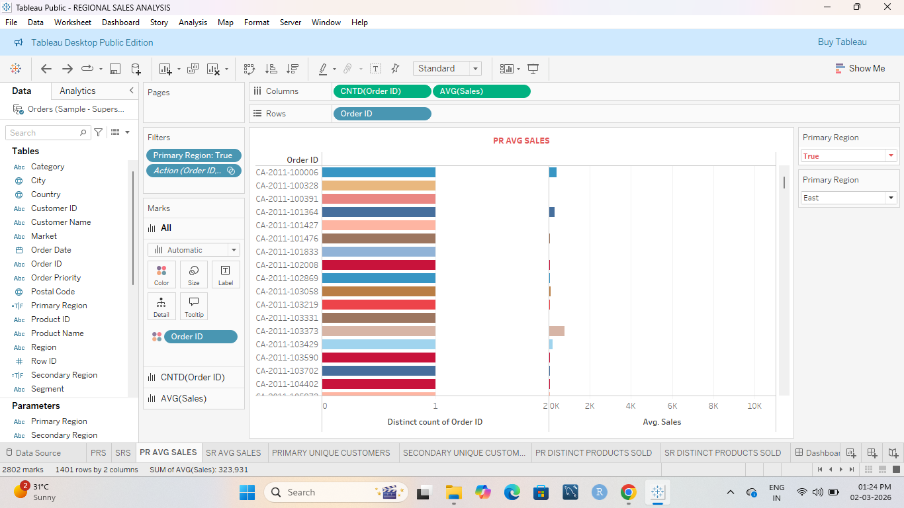
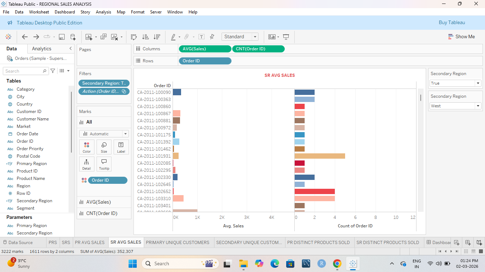
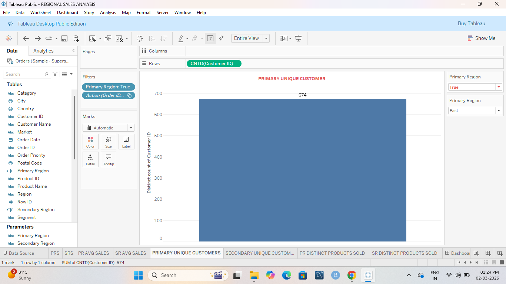

# 📊 Regional Sales Analysis Dashboard (Tableau)

## 📌 Project Overview
Developed an interactive Tableau dashboard to analyze regional sales performance across Primary and Secondary regions. The dashboard provides insights into total sales, average sales, unique customers, and distinct products sold for comparative performance analysis.

---

## 🛠 Tools & Technologies
- Tableau
- Data Visualization
- Calculated Fields
- Interactive Filters
- KPI Metrics

---

## 📈 Key Metrics
- Total Sales (Primary & Secondary Region)
- Average Sales
- Unique Customers
- Distinct Products Sold
- Regional Comparison Analysis

---

## 🎛 Dashboard Features
- Dynamic Region Filters
- Interactive Visualizations
- Comparative Regional Performance
- Category & Product-Level Insights

---

## 📷 Dashboard Screenshots

### 🔹 Main Dashboard

### 🔹 Sales Analysis View

### 🔹 Customer Insights

### 🔹 Product Analysis

### 🔹 Detailed View

---

## 🚀 Project Objective
To enable data-driven decision-making by providing clear insights into regional sales trends, customer distribution, and product performance.
